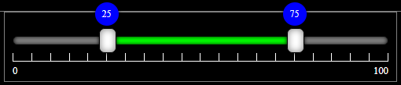

# MultiRangeSlider.js

download 
 - [MultiRangeSlider.js](https://raw.githubusercontent.com/developergovindgupta/multirangeslider/main/js/MultiRangeSlider.js)
 - [MultiRangeSlider.min.js](https://raw.githubusercontent.com/developergovindgupta/multirangeslider/main/js/MultiRangeSlider.min.js)
 - [MultiRangeSlider.css](https://raw.githubusercontent.com/developergovindgupta/multirangeslider/main/css/MultiRangeSlider.css)

source code and demo
 - [download source code](https://github.com/developergovindgupta/multirangeslider) 
 - [view demo](https://20cpl.csb.app/)
 - [view demo-style-1](https://codepen.io/developergovindgupta/pen/qBmWrbK)
 - [view demo-style-2](https://codepen.io/developergovindgupta/pen/oNWNzVm)

## Description
We face a problem that input type range allow only one value to select. If we want to select two values from a range we have no option. we need to add two input type range slider to take input min value and max value. Handling two input range control is not easy and manages events is also very difficult.
For the solution of selecting multiple value and handling events it provide a solution. It allows user to select min value and max value from a range slider. It's design layout is fully controlled by CSS and provide a lot of events to handle via JavaScript.

## How to Use

download MultiRangeSlider.js/MultiRangeSlider.min.js and include in your project.
There are two way to add this control on form 

**Method 1**

    let options ={container: document.querySelector('.container')};
    let multiRangeSlider1 = new  MultiRangeSlider(options);

**Method 2**

    let multiRangeSlider2 = new  MultiRangeSlider();
    document.querySelector('.container').appendChild(multiRangeSlider2);

## Options
This slider control can be handled by options that is passed to constructor function as explained in Method 1

    let options = {
	    container : null, // target container element where it append
		id : '', //set id attribute if passed value else unset
		baseClassName : '', // prefix of class names of all elements of range slider default "multi-range-slider" set if you want to change theme style.
	    min : 0, // slider min value default is 0
	    max : 100, // slider max value default is 100
	    step : 5, // slider step value default is ((max - min) / 20)=5
	    value_min : 25, // slider selected min value default is ((max - min) * 0.25)
	    value_max : 75, // slider selected max value default is ((max - min) * 0.75)
	    showRuler : true, // is ruler visible or not default is true
	    showValue : true, // is selected min and max value label shows or not default true
	    showLabel : true, // is slider min and max value shows or not default true
	    preventWheel : false, // is slider move with mouse wheel default is false
	    oninit : null, // eventHandlerFunction trigger when control is created by constructor.
	    onbarclick : null, // eventHandlerFunction trigger when control's bar clicked.
	    oninput : null, // eventHandlerFunction trigger when control's value change by user.
	    onchange : null, // eventHandlerFunction trigger when control's value change by user or JavaScript. 
	    onslidestart : null, // eventHandlerFunction trigger when thumb is start sliding by user.
	    onslide : null, // eventHandlerFunction triggers continuously till the thumb is sliding by user. also trigger when user click on bar.
	    onslideend : null // eventHandlerFunction trigger when thumb is stop sliding by user.
    }

## Properties and Event Listeners
This slider control can be handled by setting properties and adding event listeners as explained in Method 2

    multiRangeSliderObject.propertyName=value; 

| Property Name | Description|
|--|--|
|min|(Numeric) get/set slider min value|	
|max|(Numeric) get/set slider max value|
|step|(Numeric) get/set slider step value, controls ruler points and bar click value increment/decrement |
|value_min|(Numeric) get/set slider selected min value|
|value_max|(Numeric) get/set slider selected max value|
|minValue|(Numeric) get/set slider selected min value|
|maxValue|(Numeric) get/set slider selected max value|
|value1|(Numeric) get/set slider selected min value|
|value2|(Numeric) get/set slider selected max value|
|showRuler|(boolean) get/set slider ruler is visible or not|
|showValue|(boolean) get/set slider thumb selected min and max value is visible or not|
|showLabel|(boolean) get/set slider min and max value label is display or not|
|preventWheel|(boolean) get/set whether slider responses mouse wheel or not default is false. if true then it do not responses mouse wheel.|

## Event Listeners 
This control dispatches following events that can be handled by registering event listeners 

    multiRangeSliderObject.addEventListener("eventName",eventHandlerFunction);

 | Event Listeners | Description|
|--|--|
|barclick|trigger when user click on bar or change value by keyboard arrow key|
|input| trigger when slider value is changed by user|
|change| trigger when slider value is changed by user or JavaScript code|
|slidestart | trigger when user start slide by thumb or mouse wheel|
|slide | trigger continuously till user slide the thumb or rotating the mouse wheel|
|slideend| trigger when user release the thumb or stop rotating the mouse wheel|

 ## eventHandlerFunction Argument
 Note : eventHandlerFunction receives an argument event that have following properties.
 
 
|e.property| Description |
|--|--|
| min | slider min value |
|max| slider max value|
|step| slider step value|
|value_min| slider selected min value|
|value_max| slider selected max value|
|minValue| slider selected min value|
|maxValue| slider selected max value|
|value1| slider selected min value|
|value2| slider selected max value|
|slider| slider.bar.thumb_left/slider.bar.thumb_right|
|target| multiRangeSliderObject|

## Mouse Wheel Event Listener

|wheel| action  |
|--|--|
| shift + wheel | scroll left thumb and increment/decrement selected min value and trigger [input, change, slidestart, slide, slideend ] events |
|ctrl + wheel| scroll right thumb and increment/decrement selected max value and trigger [input, change, slidestart, slide, slideend ] events|
|shift + ctrl + wheel| scroll left and right both thumbs and increment/decrement selected min and max values and trigger [input, change, slidestart, slide, slideend ] events|

when both slider moves together then eventListener argument's slider property return array of both sliders. [slider.bar.thumb_left, slider.bar.thumb_right]

# Example Code : 

## Method - 1

### HTML 

	<link rel="stylesheet" href="./MultiRangeSlider/MultiRangeSlider2.css" />
	

	

		

		 
		 
		

	

### JS

	let onInitMultiRangeSlider = function (e) {
		document.querySelector('.multi-range-slider-result').innerHTML = 
		'minValue = ' + e.minValue + ' maxValue = ' + e.maxValue;
	};

	let onInputMultiRangeSlider = function (e) {
		document.querySelector('.multi-range-slider-result').innerHTML = 
		'minValue = ' + e.minValue + ' maxValue = ' + e.maxValue;
	};

	let options = {
		container: document.querySelector('.multi-range-slider-container'), 
		id: 'MultiRangeSlider1', 
		baseClassName: '', 
		min: 0, 
		max: 100, 
		step: 5, 
		value_min: 25, 
		value_max: 75, 
		showRuler: true, 
		showValue: true, 
		showLabel: true, 
		preventWheel: false, 
		oninit: onInitMultiRangeSlider, 
		onbarclick: null, 
		oninput: onInputMultiRangeSlider, 
		onchange: null, 
		onslidestart: null, 
		onslide: null, 
		onslideend: null, 
	};
	const multiRangeSlider1 = new MultiRangeSlider(options);
	

## Method - 2

### HTML 

	<link rel="stylesheet" href="./MultiRangeSlider/MultiRangeSlider.css" />
	

	

		

		 
		 
		

	

### JS

    import MultiRangeSlider from './MultiRangeSlider.min.js';

    const multiRangeSlider = new MultiRangeSlider();
    document.querySelector('.container .multi-range-slider-container').appendChild(multiRangeSlider);
    
    // multiRangeSlider.min = 0;
    // multiRangeSlider.max = 100;
    // multiRangeSlider.minValue = 10;
    // multiRangeSlider.maxValue = 90;
    // multiRangeSlider.step = 5;
    // multiRangeSlider.showRuler = true;
    // multiRangeSlider.showValue = true;
    // multiRangeSlider.showLabel = true;
    // multiRangeSlider.preventWheel = false;

    multiRangeSlider.oninput = (e) => {
        document.querySelector('.container .multi-range-slider-result').innerHTML = 
        'minValue = ' + e.minValue + ' maxValue = ' + e.maxValue;
    };

    document.querySelector('.container .multi-range-slider-result').innerHTML = 
    'minValue = ' + multiRangeSlider.minValue + ' maxValue = ' + multiRangeSlider.maxValue;
	

## baseClassName

### HTML

	<link rel="stylesheet" href="./MultiRangeSlider/MultiRangeSliderBlack.css" />
	

	

		

		 
		 
		

	

	

### JS

    import MultiRangeSlider from './MultiRangeSlider.min.js';

    const multiRangeSliderBlack = new MultiRangeSlider({ baseClassName: 'multi-range-slider-black' });
    document.querySelector('.container .multi-range-slider-container')
    .appendChild(multiRangeSliderBlack);
    
    
    multiRangeSliderBlack.oninput = (e) => {
        document.querySelector('.container .multi-range-slider-result').innerHTML = 
        'minValue = ' + e.minValue + ' maxValue = ' + e.maxValue;
    };

    document.querySelector('.container .multi-range-slider-result').innerHTML = 
    'minValue = ' + multiRangeSliderBlack.minValue +
     ' maxValue = ' + multiRangeSliderBlack.maxValue;
	

# License : Free to Use